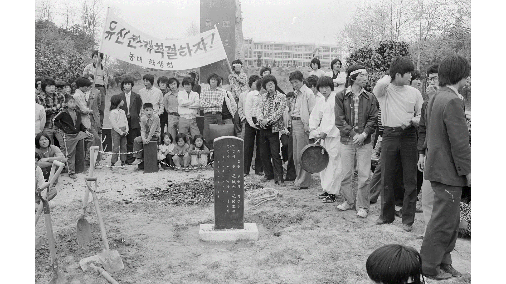
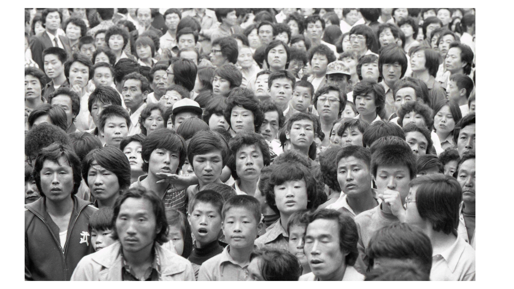
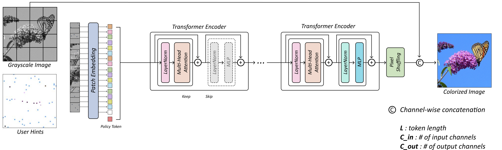
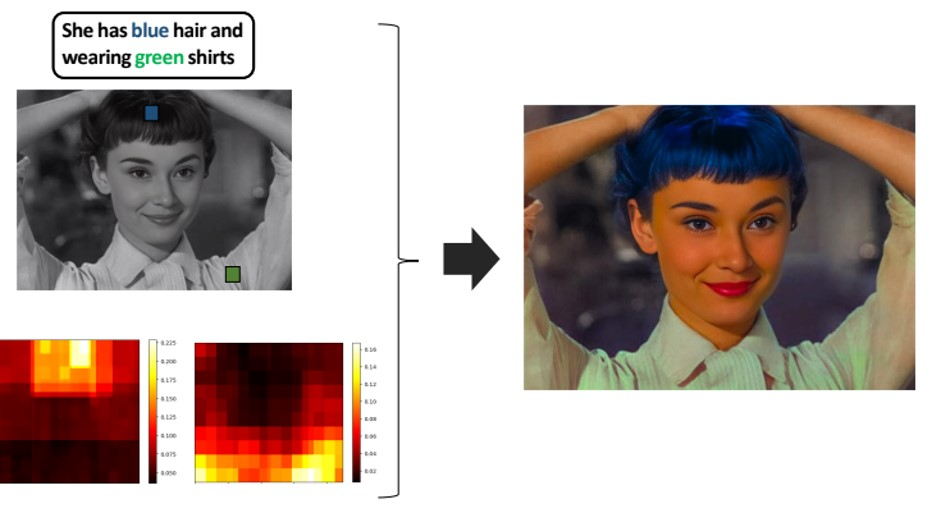
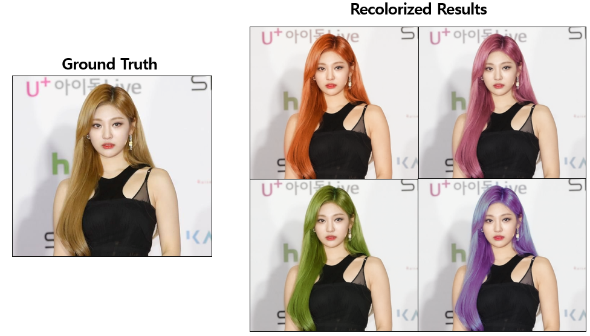
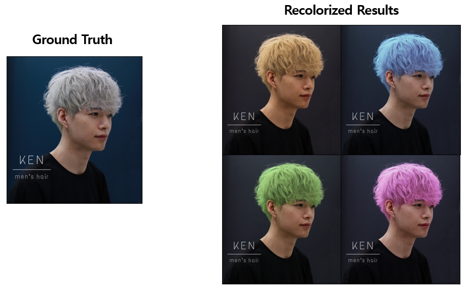
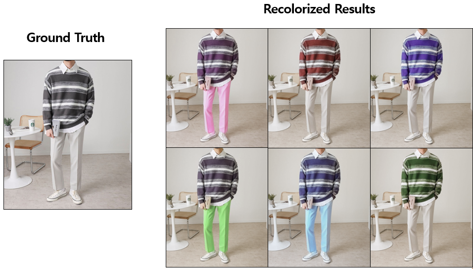
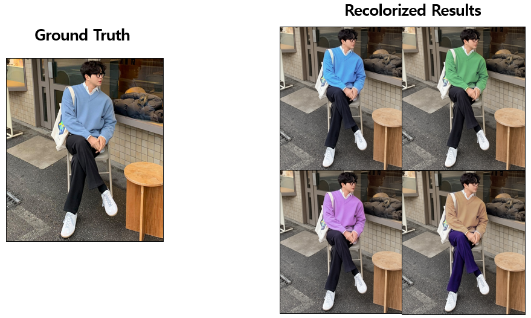
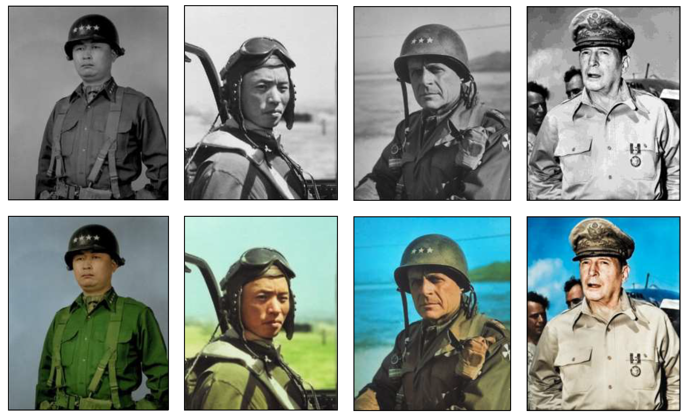
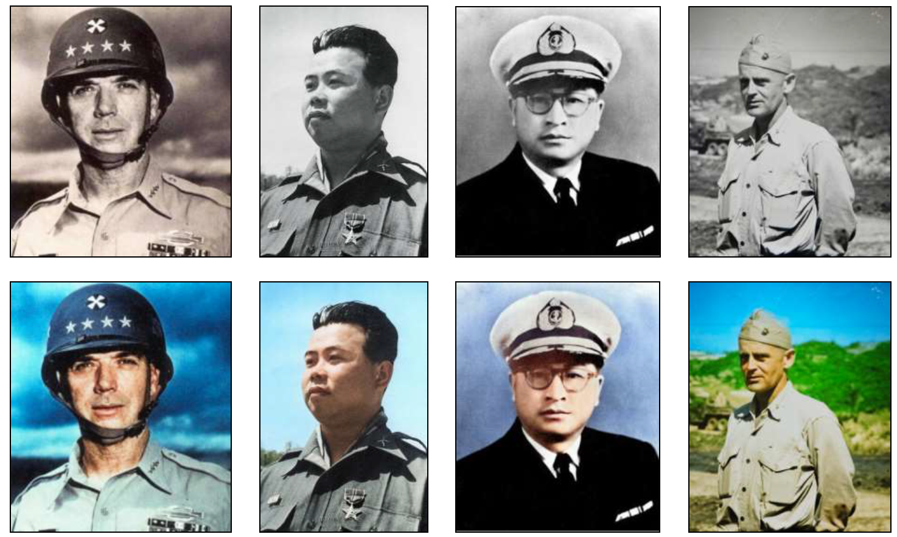

# 흑백 이미지 복원을 위한 컬러화 기술 개발

This is a project that utilizes deep learning technology to colorize black-and-white images with historical significance during the Gwangju democratization movement of May 18th. The project was developed with the support of SK Telecom as part of the AI Fellowship. Only a portion of the code has been made public, and if you are interested in more advanced techniques, please inquire via email. (icanlgh0016@gmail.com / toqufns@gmail.com)

The code consists of three main parts: Automatic Colorization, Hint-based Colorization, and Multi-modal Colorization.
- We developed Demo for Automatic Colorization and Hint-based Colorization [[DEMO]](https://github.com/SaebyeolShin/Colorization_UI)
- Through the Multi-modal Colorization code, a Chatbot has been developed to restore black-and-white images on the Kakao Channel. [[KAKAO CHANNEL]](http://pf.kakao.com/_mxgELxj)

# Automatic Colorization

"Automatic Colorization" is a method that predicts colors without user guidance. However, this method had the potential to colorize images in a way that did not align with historical facts, necessitating the development of a new approach.

# Hint-based Colorization

"Hint-based Colorization" involves coloring images according to user guidance, allowing users to specify the desired colors for the image. This enables colorization of images with historical significance using the user's prior knowledge.

# Multi-modal Colorization (Text-based Colorization)

The motivation behind developing this method was the technical implementation challenges posed by different platforms. The application of the "Image Colorization" technique, which allows user interaction, varied significantly depending on the platform. While we attempted to apply the technique through the Kakao chatbot, providing user guidance through mouse clicks, it was challenging to do so in KakaoTalk.
Therefore, we developed a method that enables image colorization in KakaoTalk using only "Text" as input. In the image provided, intermediate steps have been omitted, but the method uses CLIP to identify the desired regions and provides user guidance for those regions, allowing for "text-based image colorization."

# 후속 프로젝트
## Image Color Transfer

Rather than simply restoring black-and-white images, we wondered if this technology could be used to convert certain regions of color images into different colors. To achieve "Recolorization" into different colors, only the user's guidance needs to be provided as input. Currently, the code is naively developed, and there are many issues regarding the training process that need to be addressed, which we plan to resolve in the future.

## 6.25 참전 용사 이미지 복원

After completing an internship at SK Telecom, we wanted to apply the technology to a more meaningful way, so we attempted to restore images of the veterans in the Korean War. Since the old photos had a lot of noise, additional training techniques were required, but we have not publicly released this specific code in this page.

# Thanks for
- iColoriT (https://github.com/pmh9960/iColoriT)

    Our GUI is an updated version of the iColoriT: Towards Propagating Local Hint to the Right Region in Interactive Colorization by Leveraging Vision Transformer. Thanks for sharing the codes!
