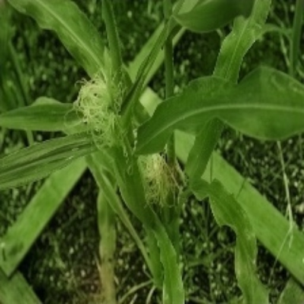

# Experiments

## Todo
- validation 너무 느린데, 더해서 풀자
- train중에 18데이터 validation으로 함께 visualize 시켜보자
- inference 사진많으면 가끔 왜안되니..?


## Preprocess Script

```bash
# 0720
## gettyimages
$ python preprocess.py --data gettyimages --data_path /home/data/colorization/gettyimages/ --size 768
python preprocess.py --data human --data_path /home/data/colorization/human --size 768 --fold 10 --depth 2
python preprocess.py --data ffhd --data_path /home/data/colorization/ffhd --size 768 --fold 10 --depth 2

python preprocess.py --data_path ./data/ffhd/ --size 1024 --fold 10 --depth 2
# no resize
python preprocess.py --data_path /home/data/colorization/street/ --fold 10 --depth 2
#
python preprocess.py --data ffhq_v2 --data_path /home/data/colorization/ffhq_else/ --size 1024 --fold 10 --depth 2
```

## Train Script
```bash

python train.py --dataset_path ./data/ffhq_v2/HR_768/train_10.csv --save_img -gpu 0,1,2,3 --backbone efficientnet-b1 --scheduler CosineAnnealingLR --epoch 50 -bs 128 -expc 0802_ffhq_v2_pretrained_noise
python train.py --dataset_path ./data/ffhq_v2/HR_768/train_10.csv --save_img -gpu 0,1,2,3 --backbone efficientnet-b1 --scheduler CosineAnnealingLR --epoch 50 -bs 64 -expc 0802_ffhq_v2_pretrained_noise --pretrained ./saved_models/Unet-efficientnet-b1-0731_ffhd_else/fold0_best.pth 

# 0802
python train.py --dataset_path ./data/ffhq_v3/HR_768/train_10.csv --save_img -gpu 4,5,6,7 --backbone efficientnet-b1 --scheduler CosineAnnealingLR --epoch 50 -bs 64 -expc 0803_ffhq_v3_pretrained_noise2 --pretrained ./saved_models/Unet-efficientnet-b1-0802_ffhq_v2_pretrained_noise/fold0_best_e50.pth --val_iter 1

# 0806 coarsedropout (no deepfashion2)
python train.py --dataset_path ./data/ffhq_v2/HR_768/train_10.csv --save_img -gpu 4,5,6,7 --backbone efficientnet-b1 --scheduler CosineAnnealingLR --epoch 50 -bs 64 -expc 0806_ffhq_v2_pretrained_cutout --pretrained ./saved_models/Unet-efficientnet-b1-0803_ffhq_v3_pretrained_noise2/fold0_best_e50.pth --val_iter 1

#0808 (768 to 1024 pretrained training)
python train.py --dataset_path ./data/ffhq_v2/HR_1024/train_10.csv --save_img -gpu 4,5,6,7 --backbone efficientnet-b1 --scheduler CosineAnnealingLR --epoch 50 -bs 32 -expc 0808_ffhq_v2_pretrained_1024 --pretrained ./saved_models/Unet-efficientnet-b1-0806_ffhq_v2_pretrained_cutout/fold0_best_e47.pth --val_iter 1

#0809 new aug (random resized crop)
#  (resnet50)
python train.py --dataset_path ./data/ffhq_v2/HR_768/train_10.csv --save_img -gpu 0,1,2,3 --backbone resnet50 --scheduler CosineAnnealingLR --epoch 50 -bs 64 -expc 0809_ffhq_v2_new_aug --val_iter 1

# 0810 (random resized crop, pretrained)
python train.py --dataset_path ./data/ffhq_v2/HR_768/train_10.csv --save_img -gpu 0,1,2,3 --backbone efficientnet-b1 --scheduler CosineAnnealingLR --epoch 50 -bs 64 -expc 0810_ffhq_v2_pretrained_rrc --pretrained ./saved_models/Unet-efficientnet-b1-0806_ffhq_v2_pretrained_cutout/fold0_best_e47.pth --val_iter 1 -lr 5e-5

# 0811, activation tanh
python train.py --dataset_path ./data/ffhq_v2/HR_768/train_10.csv --save_img -gpu 0,1,2,3 --backbone efficientnet-b1 --scheduler CosineAnnealingLR --epoch 50 -bs 64 -expc 0811_ffhqv2_activation_tanh --pretrained ./saved_models/Unet-efficientnet-b1-0806_ffhq_v2_pretrained_cutout/fold0_best_e47.pth --val_iter 1

# 0814 (l2 loss, random resized crop, pretrained)
python train.py --dataset_path ./data/ffhq_v2/HR_768/train_10.csv --save_img -gpu 4,5,6,7 --backbone efficientnet-b1 --scheduler CosineAnnealingLR --epoch 50 -bs 64 -expc 0814_ffhq_v2_L2loss_pretrained_rrc --pretrained ./saved_models/Unet-efficientnet-b1-0806_ffhq_v2_pretrained_cutout/fold0_best_e47.pth --loss mse --val_iter 1

# 0817 (pretrained, + imagenet training)
python temp_imagenet_train.py --dataset_path ./data/ffhq_v2/HR_768/train_10.csv --save_img -gpu 0,1,2,3 --backbone efficientnet-b1 --scheduler CosineAnnealingLR --epoch 12 -bs 64 -expc 0817_ffhq_v2_pretrained_imagenet_fuse --pretrained ./saved_models/Unet-efficientnet-b1-0806_ffhq_v2_pretrained_cutout/fold0_best_e47.pth --val_iter 1 -lr 5e-5

# 0818 (pretrained, 384)
python train.py --dataset_path ./data/ffhq_v2/HR_384/train_10.csv --save_img -gpu 4,5,6,7 --backbone efficientnet-b1 --scheduler CosineAnnealingLR --epoch 50 -bs 128 -expc 0818_ffhq_v2_pretrained --pretrained ./saved_models/Unet-efficientnet-b1-0806_ffhq_v2_pretrained_cutout/fold0_best_e47.pth --val_iter 1

# 0820 (new, lab 새롭게 정의, tanh로 시도)
python train2.py --dataset_path ./data/ffhq_v2/HR_768/train_10.csv --save_img -gpu 4,5,6,7 --backbone efficientnet-b1 --scheduler CosineAnnealingLR --epoch 50 -bs 64 -expc 0820_ffhqv2_newlab_tanh --pretrained ./saved_models/Unet-efficientnet-b1-0806_ffhq_v2_pretrained_cutout/fold0_best_e47.pth --activation tanh --val_iter 1

# 0820 (fruits 추가)
python train.py --dataset_path ./data/ffhq_v3/HR_768/train_10.csv --save_img -gpu 4,5,6,7 --backbone efficientnet-b1 --scheduler CosineAnnealingLR --epoch 50 -bs 64 -expc 0820_ffhqv3 --pretrained ./saved_models/Unet-efficientnet-b1-0806_ffhq_v2_pretrained_cutout/fold0_best_e47.pth --val_iter 1

# 0826
python train2.py --dataset_path ./data/ffhq_v4/HR_768/train_10.csv --save_img -gpu 4,5,6,7 --backbone efficientnet-b1 --scheduler CosineAnnealingLR --epoch 50 -bs 64 -expc 0825_ffhqv4_newlab_tanh --activation tanh --val_iter 1
```
## Validation
```bash
python val.py --backbone <your_models> -sm <your_saved_models_path> --save_img -expc sample 
```

## Inference & Demo
```bash
python inference.py --backbone efficientnet-b0 -gpu 2,3 --img_path ./data/animal/ --depth=2 -sm ./saved_models/Unet-efficientnet-b0-large_dataset_384-new_384/fold0_best.pth -expc
python inference.py --backbone efficientnet-b1 -gpu 0,1,2,3 --img_path ./data/color_SR_After/ -bs 128 --depth=1 -sm ./saved_models/Unet-efficientnet-b1-gettyimages_768-0719/fold0_best.pth

# 0803
python inference_patch.py --backbone efficientnet-b1 --img_path /home/data/colorization/skt_sample/ --depth=1 -sm ./saved_models/Unet-efficientnet-b1-0803_ffhq_v3_pretrained_noise2/fold0_best_e9.pth -expc temp_power_ensemble --gpu=0,1 --image --patch

#0808
python inference_patch.py --backbone efficientnet-b1 --img_path /home/data/colorization/skt_sample/ --depth=1 -sm ./saved_models/Unet-efficientnet-b1-0808_ffhq_v2_pretrained_1024/fold0_best_e37.pth -expc 0808_ffhqv2_1024_e37_bright  --gpu=1,2 --image --patch

# 0809 random resized crop
python inference_patch.py --backbone resnet50 --img_path /home/data/colorization/skt_sample/ --depth=1 -sm ./saved_models/Unet-efficientnet-b1-0808_ffhq_v2_pretrained_1024/fold0_best_e37.pth -expc 0809   --gpu=4,5 --image --patch

# 0810 rrc, b1, pretrained-retrain
python inference_patch.py --backbone efficientnet-b1 --img_path /home/data/colorization/skt_test/ --depth=1 -sm ./saved_models/ -expc 0810-rrc   --gpu=6,7 --image --patch

# 0818 384
python inference_patch.py --backbone efficientnet-b1 --img_path /home/data/colorization/skt_sample/ --depth=1 -sm ./saved_models/Unet-efficientnet-b1-0818_ffhq_v2_pretrained/fold0_best_e23.pth -expc sample  --gpu=6,7 --image --patch

# 0818 1024
python inference_patch.py --backbone efficientnet-b1 --img_path /home/data/colorization/skt_test/ --depth=1 -sm ./saved_models/Unet-efficientnet-b1-0808_ffhq_v2_pretrained_1024/fold0_best_e47.pth -expc 1024  --gpu=2,3 --image --patch


# 0820 new / pillow / new lab
python inference_patch2.py --backbone efficientnet-b1 --img_path /home/data/colorization/skt_sample/ --depth=1 -sm  -expc new_lab  --gpu=1,3 --image --patch
#0820 / skt test 2 (발표용 비공식)
python inference_patch.py --backbone efficientnet-b1 --img_path /home/data/colorization/skt_test2/ --depth=1 -sm ./saved_models/Unet-efficientnet-b1-0806_ffhq_v2_pretrained_cutout/fold0_best_e47.pth -expc 0820_forppt   --gpu=2,3 --image --patch
python inference_patch.py --backbone efficientnet-b1 --img_path /home/data/colorization/skt_test2/ --depth=1 -sm ./saved_models/Unet-efficientnet-b1-0820_ffhqv3/fold0_best_e2.pth -expc 0820_fruit_forppt --gpu=2,3 --image --patch

# 0825 new / new lab /  ffhqv4
python inference_patch2.py --backbone efficientnet-b1 --img_path /home/data/colorization/skt_test2/ --depth=1 -sm ./saved_models/Unet-efficientnet-b1-0825_ffhqv4_newlab_tanh/fold0_best_e20_psnr24.56.pth  -expc 0826_new_lab2  --gpu=0,1 --image --patch --activation tanh

```

## Best Inference
```bash
# best1
python inference_patch.py --backbone efficientnet-b1 --img_path /home/data/colorization/skt_test/ --depth=1 -sm ./saved_models/ -expc 0810-rrc   --gpu=6,7 --image --patch

# best2 (fruit 학습 후)
python inference_patch2.py --backbone efficientnet-b1 --img_path /home/data/colorization/skt_test2/ --depth=1 -sm ./saved_models/Unet-efficientnet-b1-0825_ffhqv4_newlab_tanh/fold0_best_e20_psnr24.56.pth  -expc 0826_new_lab2  --gpu=0,1 --image --patch --activation tanh
```

## Visualize (Unet-efficientnetb0)
<!-- {: width="256" height="256"}
{: width="256" height="256"}
{: width="256" height="256"}
{: width="256" height="256"} -->

<!--  

  -->


<!-- ## 0618-0620
1. 4x model (O)
2. activitynet 학습 (O)
3. 2x,4x,8x등 데이터셋 따로저장 만들기 (현재는 torch resize사용) (not patch version)
4. patch version으로 2x,4x,8x 만들기 / validation은 patch merging고려
5. inference 할때 이미지 들어오면 알아서 patch단위로 나누고 예측한후 merging까지 하는 코드짜기
5. 코드에서 labels to x4 이런단어로 바꿀때 단어 바꾸니까, path명중에 겹치는게 바뀌어버리네..


1. 4X 모델에 넣고, 맨 마지막 block 빼기
2. classification or regression(LAB)
3. psnr은 rgb로 고쳐놓고 재기 (현재 naive psnr임)
4. best마다만 저장되게하자 이미지
5. validatoin inference?
6. import 필요없는 라이브러리 지우기