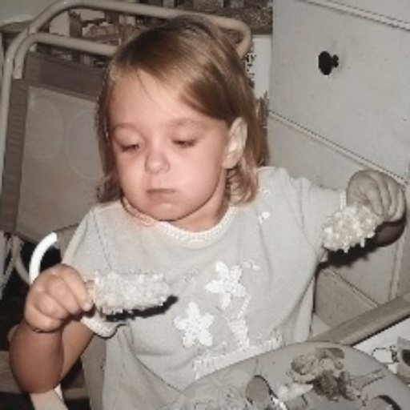

# ActivityNet Experiments


### Datasets
- 6,996 video clips
- 170,362 frames
- Train 80% / Val 20%
- GroupKFold

## ActivityNet Data Path 

```
​```
${ActivityNet}}
├── 384(resized_size)
|   └── XXXXX_frames
|       └── xxxx.jpg
|       └── ...
​```
```

## Preprocess Script

```bash
# ActivityNet dataset
$ python preprocess.py
```

## Train Script
```bash
# baseline
# 추후에 더 추가 예정
$ python ./script/base_activitynet.py
```

## Inference & Demo
```bash
python inference.py --backbone <your_models> -sm <your_saved_models_path> --save_img -expc sample 
```

## Visualize (Unet-efficientnetb0)
<!-- {: width="256" height="256"}
{: width="256" height="256"}
{: width="256" height="256"}
{: width="256" height="256"} -->

<!--  

  -->


<!-- ## 0618-0620
1. 4x model (O)
2. activitynet 학습 (O)
3. 2x,4x,8x등 데이터셋 따로저장 만들기 (현재는 torch resize사용) (not patch version)
4. patch version으로 2x,4x,8x 만들기 / validation은 patch merging고려
5. inference 할때 이미지 들어오면 알아서 patch단위로 나누고 예측한후 merging까지 하는 코드짜기
5. 코드에서 labels to x4 이런단어로 바꿀때 단어 바꾸니까, path명중에 겹치는게 바뀌어버리네..


1. 4X 모델에 넣고, 맨 마지막 block 빼기
2. classification or regression(LAB)
3. psnr은 rgb로 고쳐놓고 재기 (현재 naive psnr임)
4. best마다만 저장되게하자 이미지
5. validatoin inference?
6. import 필요없는 라이브러리 지우기