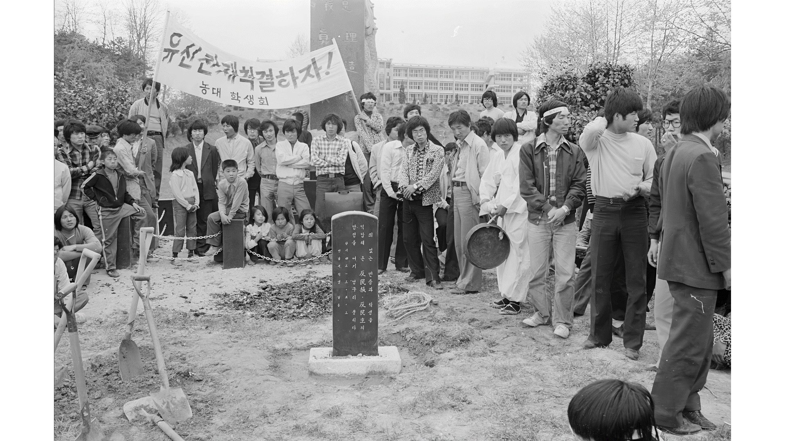
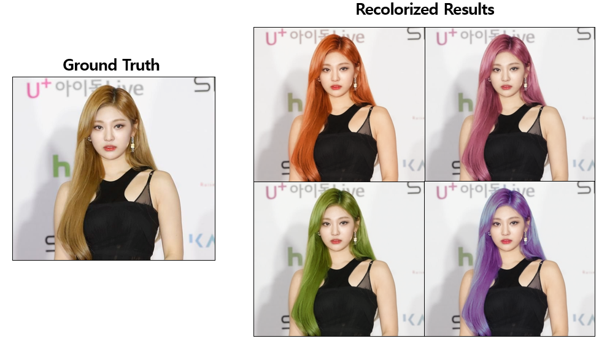
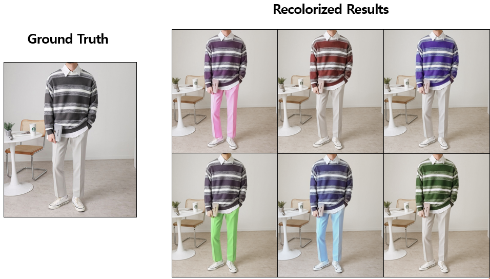

# 흑백 이미지 복원을 위한 컬러화 기술 개발 [[ENG Ver.](./English_readme.md)]

5.18 민주화 운동 당시의 역사적 의미를 가지는 흑백이미지를 딥러닝 기술을 활용해 컬러화 시키는 프로젝트입니다. 본 프로젝트는 SK텔레콤에서 AI Fellowship 학생으로 선정되고 지원을 받아 개발된 코드입니다. 코드는 일부분만 공개되었으며, 더욱 고도화된 기술을 원하시는 분은 따로 메일로 문의주세요.

코드는 크게 Automatic Colorization, Hint-based Colorization, Multi-modal Colorization으로 이루어져있습니다. Multi-modal Colrozation 코드를 통해 카카오채널에서 흑백이미지를 복원하는 챗봇까지 개발했습니다.
- [[DEMO]](https://github.com/SaebyeolShin/Colorization_UI)
- [[KAKAO CHANNEL]](http://pf.kakao.com/_mxgELxj)

# Automatic Colorization

"Automatic Colorization"은 유저의 가이드 없이 예측하는 방법입니다. 해당 방법은 역사적 사실과 맞지 않은 이미지 채색이 될 수가있었기에, 새로운 방법이 필요했습니다.

# Hint-based Colorization

"Hint-based Colorization"은 유저의 가이드에 따라 유저가 원하는 색으로 이미지 채색이 진행됩니다. 따라서 역사적 의미를 가지는 사진에 유저의 사전지식을 사용해 이미치 채색을 가능하게 만듭니다.

# Multi-modal Colorization (Text-based Colorization)

해당 방법을 개발하게 된 계기는 플랫폼에 따라 생기는 기술적용 문제점 때문입니다. 유저가 상호작용 가능한 "Image Colorization" 기법을 배포하기 위해서는 어떤 플랫폼에서 사용하느냐에 따라 기술적용이 많이 달라졌습니다. 저는 카카오챗봇을 통해 기술을 적용하려 했지만, 일반적으로 마우스 클릭을 통해 유저 가이드를 제공하는 방식은 카카오톡에서 사용하기 어려웠습니다.
이에따라, 카카오톡에서 "Text"만으로도 이미지 채색이 가능하도록 하는 방법을 개발했습니다. 위 사진에서는 중간과정이 생략되었지만, CLIP을 통해 원하는 영역을 찾고 해당 하는 영역에 유저 가이드를 제공하여 "텍스트 기반 이미지 채색"이 가능하도록 만들었습니다.

# 후속 프로젝트
## Image Color Transfer

단순히 흑백이미지를 복원하는 것이 아니라, 해당 기술을 활용해 컬러 이미지의 일부 영역을 다른 색으로 변환할 수 있지 않을까? 하는 의문에서 해당 프로젝트를 시작했습니다. 다른 색으로 "Recolorization" 하기 위해서는 유저의 가이드만 인풋으로 함께 입력하면 됩니다. 현재는 나이브하게 코드가 개발되어 있고, 학습 자체에 많은 이슈가 존재하여 추후에 이를 해결할 생각입니다.

## 6.25 참전 용사 이미지 복원

SK텔레콤에서의 인턴을 마친 후, 조금 더 의미있는 곳에 기술을 적용해보고자 6.25 참전용사 분들의 이미지를 복원해보았습니다. 옛날 사진들에 노이즈가 너무 많아 추가적인 학습 테크닉이 필요했습니다. 본 코드에는 따로 공개하지 않았습니다.

# Thanks for
- iColoriT (https://github.com/pmh9960/iColoriT)

    ViT를 사용해 Hint-based Colorization 코드가 깔끔하게 개되어 있어 정말 많은 도움을 받았습니다, 또한 Demo를 만드는데 많은 도움을 받았습니다.

# TODO
- 각각 코드에 학습 방법 readme 작성하기
